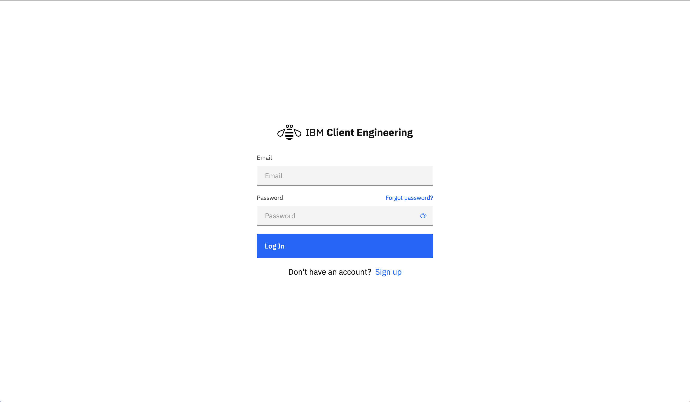
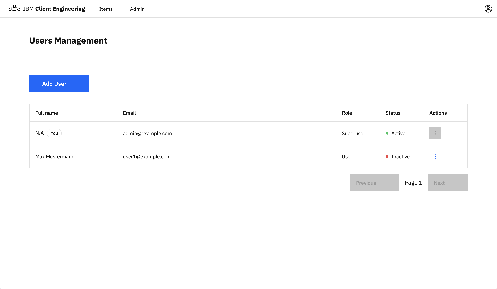
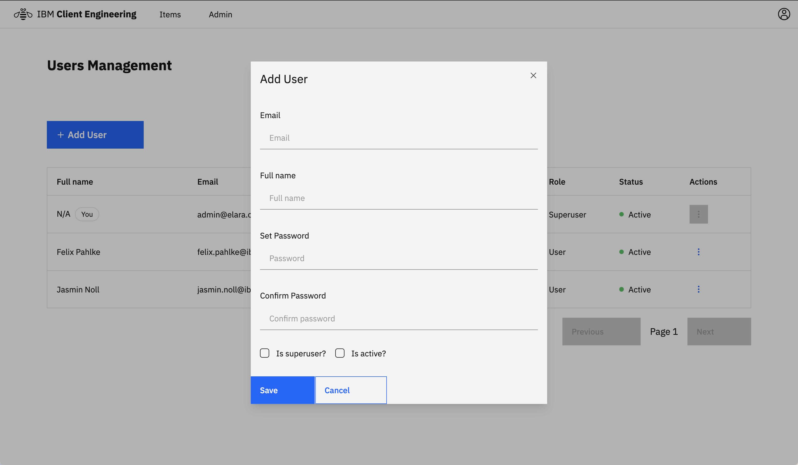
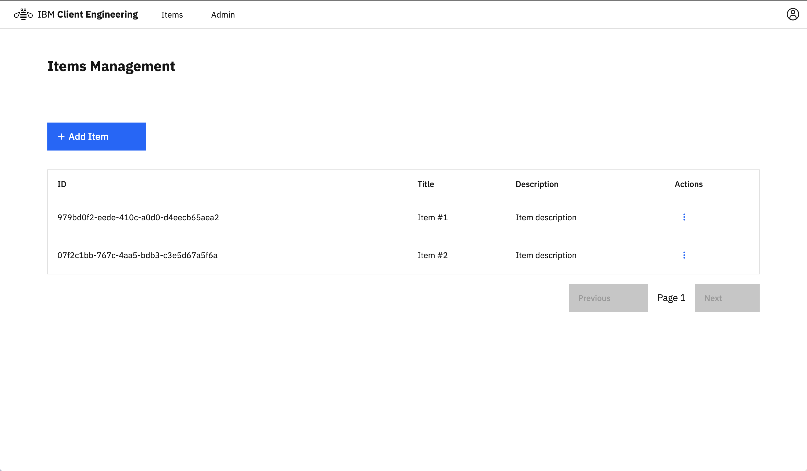
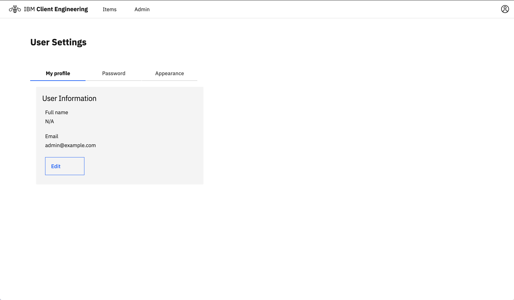
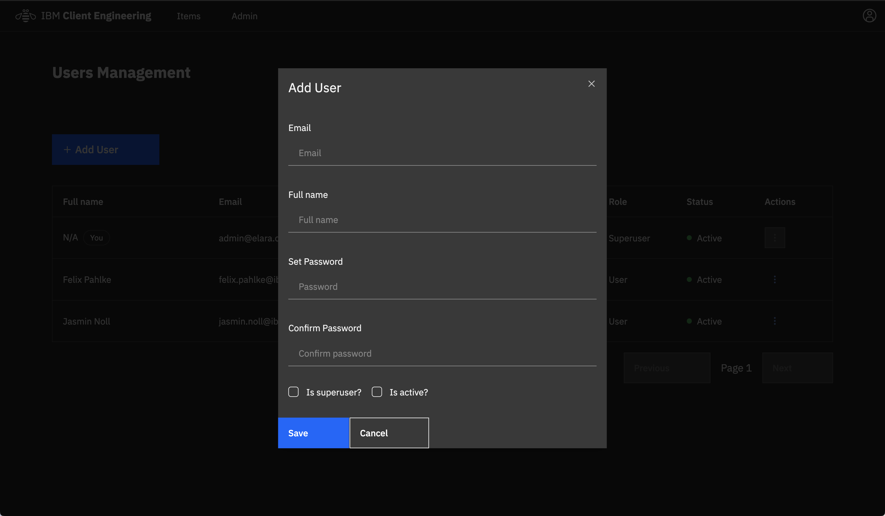

# Full Stack Client Engineering Template

## Technology Stack and Features

- ⚡ [**FastAPI**](https://fastapi.tiangolo.com) for the Python backend API.
  - 🧰 [SQLModel](https://sqlmodel.tiangolo.com) for the Python SQL database interactions (ORM).
  - 🔍 [Pydantic](https://docs.pydantic.dev), used by FastAPI, for the data validation and settings management.
  - 💾 [PostgreSQL](https://www.postgresql.org) as the SQL database.
- 🚀 [React](https://react.dev) for the frontend.
  - 💃 Using TypeScript, hooks, Vite, and other parts of a modern frontend stack.
  - 🎨 [Carboncn UI](https://www.carboncn.dev/) for the frontend components. You can also use [Carbon](https://carbondesignsystem.com/)
  - 🤖 An automatically generated frontend client.
  - 🦇 Dark mode support.
- 🐋 [Docker Compose](https://www.docker.com) & [Rancher Desktop](https://rancherdesktop.io/) for development.
- 🔒 Secure password hashing by default.
- 🔑 JWT (JSON Web Token) authentication.
- 📫 Email based password recovery.
- 🚢 Deployment instructions using OpenShift.

_This Template is based on [full-stack-fastapi-template](https://github.com/fastapi/full-stack-fastapi-template)_

<table>
<tbody>
<tr>
<td>

### Dashboard Login



</td>
<td>

### Dashboard - Admin



</td>
</tr>
<tr>
<td>

### Dashboard - Create User



</td>
<td>

### Dashboard - Items



</td>
</tr>
<tr>
<td>

### Dashboard - User Settings



</td>
<td>

### Dashboard - Dark Mode



</td>
</tr>
<tr>
<td>

### Interactive API Documentation


</td>
<td></td>
</tr>

  </tbody>
</table>

## How To Use It

You can **just clone** this repository

```bash
git clone https://github.com/kulimantang/full-stack-cen-template.git
```

cd into the folder & delete it's `.git` folder

```bash
cd full-stack-cen-template

rm -rf .git
```

and push it into your own project you created within GitHub/GitLab.

```bash
git init --initial-branch=main
git remote add origin <your_repository_url_here>
git add .
git commit -m "Initial commit"
git push --set-upstream origin main
```

✨ It just works. ✨

## Development

General development docs: [development.md](./development.md).

## Deployment

Deployment docs: [deployment.md](./deployment.md).

This includes using Docker Compose, custom local domains, `.env` configurations, etc.

## Backend Development

Backend docs: [backend/README.md](./backend/README.md).

## Frontend Development

Frontend docs: [frontend/README.md](./frontend/README.md).

## Release Notes

Check the file [release-notes.md](./release-notes.md).

## License

The Full Stack FastAPI Template is licensed under the terms of the MIT license.
