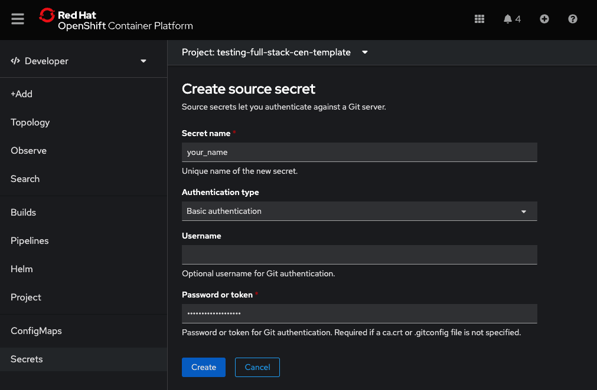
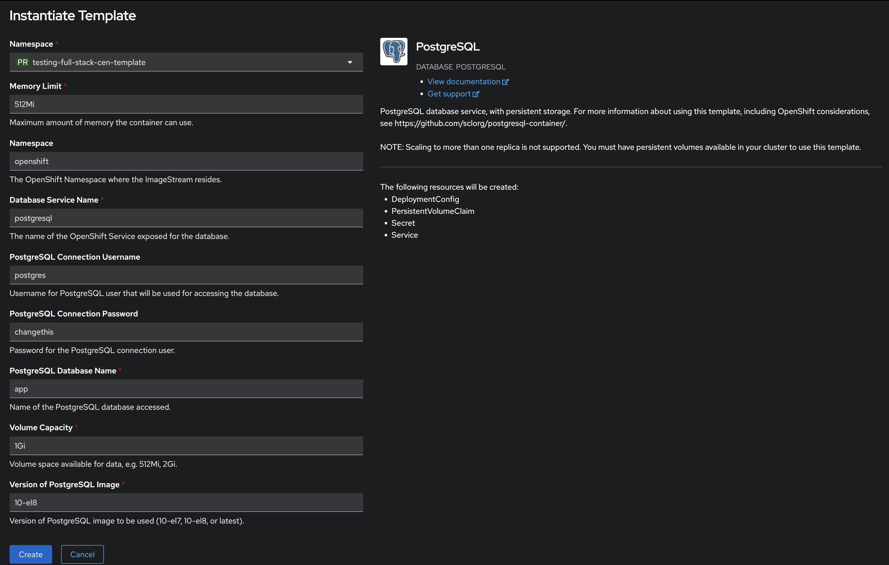

# FastAPI Project - Deployment

This Readme will describe the deployment on OpenShift

## Our journey to a successful deployment

The steps should be performed in this exact order.

1. [Preparation](#preparation)
2. [Deploying the Database](#database)
3. [Deploying the Backend](#backend) ⚠️ It will run with errors until the [config map](#env-config-map) is finished (which we can only finish in the end).
4. [Deploying the Frontend](#frontend)
5. [Finish up the Env Config Map](#env-config-map)
6. [Setup a deployment hook](#setup-a-deployment-hook)

## Preparation

1. If not already done, have this codebase pushed to your Gitlab / Github repo
2. Create AccessToken for your project in Gitlab/Github
3. Get OpenShift Instance, Open the Console and access the "Developer View"
4. Create a new project in OpenShift
5. Put the AccessToken in OpenShift as a Secret (Source Secret)
   - Username is empty
   - Password is the token

## Database

1. In you project click "+Add" → Developer Catalog → Database → PostgreSQL → Instantiate Template
2. Fill out the Template according to the Screeshot, **MAKE SURE TO CHANGE THE PASSWORD** of the PostgreSQL User.
3. Click "Create"
4. If you are not automatically redirected, you can monitor the instanciation progress in "Topology".

## Backend

1. In you project click "+Add" → import from git
2. Input your repo-url and open "Advanced Git Options"
3. Then enter `/backend` as Context dir
4. Select the Source Secret, that you have set up before in [Preperation](#preperation)

5. Select Dockerfile as Import Strategy
6. Define the Name of the Dockerfile to `Dockerfile`
7. Name your Application (Name for everything alltogether) and this particular Service (the backend)

8. Set the port to `8000`
9. If not already set choose "create route"

10. Click "Create" and - again, monitor the deployment progress in "Topology"
11. Move your database container into the application group (with "⇧shift" + drag&drop)

**<mark>Don't worry, deployment will run with errors at this point, since config map is not set yet - we will solve this later</mark>**

## Frontend

## Env Config Map

asdfawe

## Adminer

## Setup a Deployment Hook
